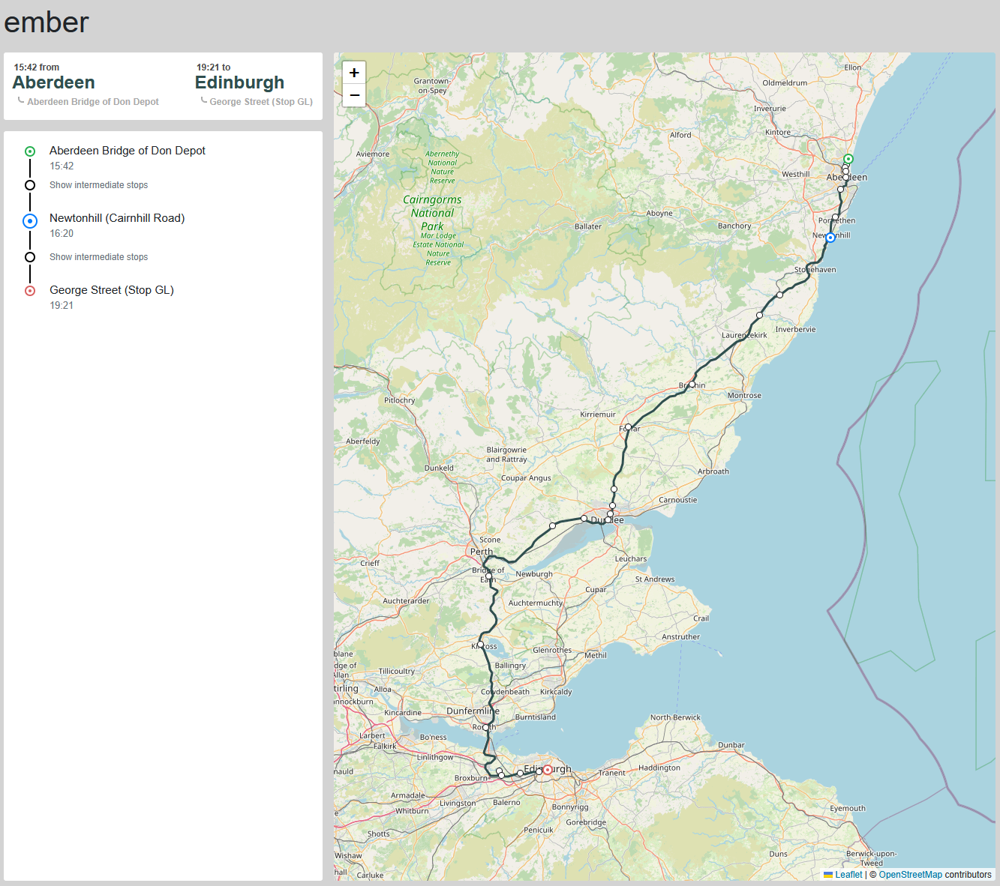

# Ember Trips Page

This project serves as an example of a shareable page that overviews a preset route from Aberdeen to Edinburgh using the Ember route APIs. The start and end destination are fixed, but the populated route is queried based on the current time. 

This project was developed using C#/.NET 8.0 and the Blazor framework. I chose this framework for ease of development, and because it seemed well-suited to create components for desired aspects of the project that could be shared across different views. As a result of using Blazor, the `Leaflet.js`/`OpenStreetMap` component is integrated via the dependency-injected `IJSRuntime` which allows interoperability between C# server code and client-side Javascript code.

The shareable page contains three main components: a route overview (including the start and end locations and times), a route breakdown (including all stops along the route as well as their scheduled times), and a map (overviewing the stops and a possible route between locations). Components will render skeleton views while the data is being queried. The route breakdown and map include special icons indicating the start location, end location, and the stop that's up next.

Two project configurations were created: a `Development` configuration, which populates the view from a self-hosted controller with fixtures that mock query results, and a `Production` configuration, which pulls results from the Ember API route.

The project can be run from the `EmberTripsPage` directory, with `dotnet run`.

Tests can be run from the root directory, with `dotnet test`.

## Component Tests

This project contains a few tests for the `Route` and `Overview` components. These test basic functionality and assert that the markup matches the expected result in select scenarios. Given more time, I would expands these tests to include additional edge cases for component rendering. Additionally, I would add tests for the remaining components (`Map`, `Header`, and the entire `Trips` page). 

Outside of component tests, I want to add tests for the data models, asserting that certain pre- and post-processing is occurring, data validation is handled properly, and that results injected into markup are formatted correctly (specifically, times and names).

## Future Goals

### Dynamic start/current/end locations

Since the project goals were to use a fixed start and end location, the view only displays a singular route. Ideally, we would populate start and end locations via URL parameters that could be passed to the API query. This would enable link-sharing for any start and end location. 

The view automatically chooses the _next available_ route between the start and end locations, but in production this should be set dynamically via URL parameters as well.

Additionally, the route breakdown and map show a fixed "next" location, but this should be computed from details within the route returned via the `trips` API, or potentially via GPS information about the vehicle.

### Distinctions between arrival/departure times, and scheduled/estimated/actual times

Currently, the route breakdown and map only indicate the estimated departure time from a given location. From the results I've inspected, these times seem to be identical between the departure and arrival, but obviously the estimated and actual times would be different once those are known. Since those aren't easily accessible to me, I haven't included any logic to display them. Estimated times would be relevant for indicating when a stop may be delayed, or for showing historical data (to reflect how on-time the route is so far).

I suspect certain stops may have a more relevant distinction between the arrival and departure times as well, and as such, if there are substantial differences between these, I would want to display that distinction (and indicate some kind of "estimated layover time").

### More detailed map

The map, overviewing the stops and predicted route, currently only displays simple route information: the stop names, locations, and stop times. These values are the most relevant for users wanting to get an overview of the route, but additional details could be added. Some ideas I would want to implement with more time would include: an estimated time of arrival in addition to the scheduled time, any reported delays along the route, and additional location information (a Google maps link to the location, details about amenities at the stop, and predicted wait time at the stop).

Additionally, the map does not include GPS information about the vehicle along the route. The `trips` API does return this information, and it would be a valuable addition to the map to provide a better indication of where the vehicle currently is.

### Better view/view-model/model separation

For ease and speed of development, there is pretty tight coupling between the results returned via the `quotes` / `trips` APIs and the view. In production environments, this coupling makes data validation and handling scenarios where the APIs return malformed results more difficult. 

Ideally, I would want to createa view-model for each component that contains only the pieces of information necessary for rendering that view, as opposed to the entire result returned by the `trips` API. These view-models could then perform data validation when being populated with the API results and have error-handling to display sensible default values within the view. As of right now, data validation is limited to only validating that the result from the API was returned. This should be expanded to handle individual sections of the API results being missing.

This separation would also make unit testing simpler, allowing testing of individual components without relying on a fixture which populates the entire API result.

#### Automatically updating components

Better view/view-model/model separation would also allow for easily updating individual components with new information. In the current state, the only solution to see updated information returned from the APIs would be to repopulate the entire data model and re-render the entire page. This doesn't necessarily lead to performance issues, since the data model is comparatively small and the data validation and pre-processing is limited, but it does prevent us from dynamically updating individual results and indicating how 'out-of-date' a result is.

With individual view-models for each component, each component could be populated with only the data necessary for it to render, and could poll for individual component needs (such as the map component polling for the current vehicle GPS location). 

Results that are shared across multiple components, (such as route stops, with the scheduled, estimated, and actual arrival/departure times, which are currently shared by the route breakdown and the map), could be polled at higher levels and populated into components to trigger re-renders of selected sections of the components.

#### Streamline API queries

Currently, I leverage the `quotes` and `trips` APIs as monoliths to retrieve all of the required data at once. With better view/view-model/model separation, it would likely be more efficient and robust to retrieve selected results individually. This would help avoid repopulating large sets of results at once (and, as a result, re-render only the components that need to be re-render), but also reduce the risk of queries that take too long or have dropped packets and return corrupted results.

### Media-specific views and better overall styling

As of now, I currently only have CSS logic to support a desktop view. Additional views could be easily added via `@media` queries in the CSS to support different grid layouts (perhaps overview, map, followed by the route-overview).

Additionally, I've gone fairly minimal with the styling, but in a production project I would want to make sure the page is consistent with other Ember pages, includes relevant headers, navigation menus, and footers.